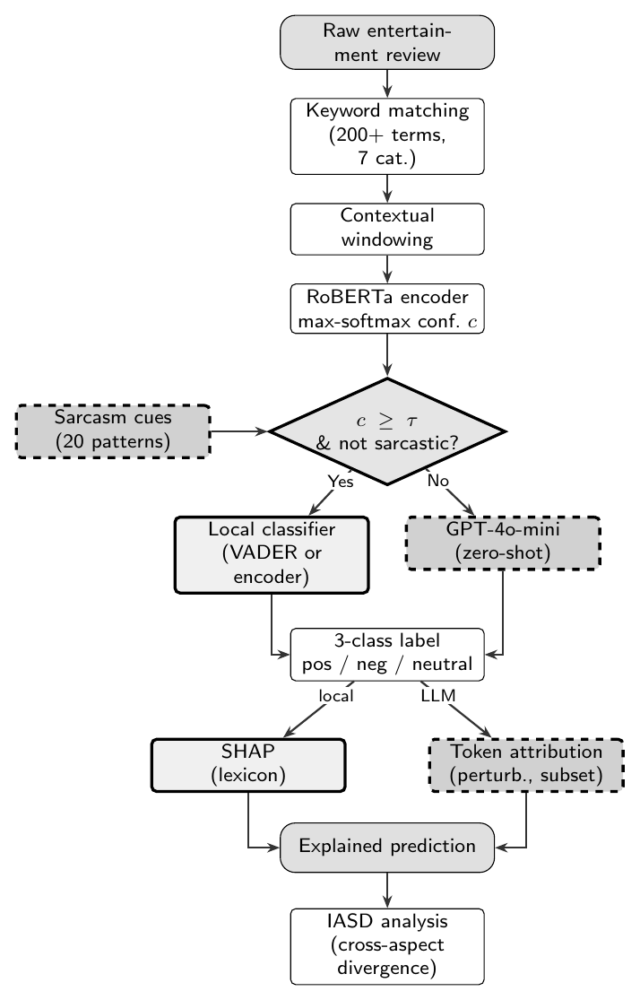

# Supplementary Material

Material referenced in the manuscript but held here rather than in the paper, to
keep the submission within the journal's page allowance. None of it was raised as
a concern in review; it is provided in full below.

Contents:

1. [Per-aspect performance](#1-per-aspect-performance)
2. [Pipeline architecture figure](#2-pipeline-architecture)
3. [Annotation protocol for the proposed benchmark](#3-annotation-protocol)
4. [LLM prompt template](#4-llm-prompt-template)

All figures below are reproducible with `python3 recompute_all.py`, which makes no
API calls.

---

## 1. Per-aspect performance

Coverage-F1 within each aspect category, recommended configuration (encoder on the
local path, τ = 0.85). F1 is macro-F1 over committed predictions within that
aspect; %LLM is the share of that aspect's mentions escalated.

| Aspect | Cov-F1 | Precision | Recall | %LLM | N |
|---|---|---|---|---|---|
| Narrative | 0.830 | 0.840 | 0.825 | 57 | 7,498 |
| Performance | 0.846 | 0.846 | 0.848 | 52 | 8,056 |
| Visual | 0.795 | 0.795 | 0.796 | 58 | 6,796 |
| Audio | 0.808 | 0.811 | 0.807 | 59 | 3,563 |
| Emotional Impact | 0.818 | 0.819 | 0.818 | 55 | 6,866 |
| Cultural Relevance | 0.810 | 0.811 | 0.813 | 70 | 2,871 |
| Technical | 0.827 | 0.831 | 0.825 | 60 | 5,665 |

Performance scores highest (0.846), consistent with explicit evaluative language
about acting; Visual is lowest (0.795). The spread is narrow (0.795–0.846), so
committed-prediction quality is stable across the taxonomy rather than driven by
one or two easy categories. The N-weighted mean of 0.822 is close to the pooled
value of 0.823 reported in Table 1 of the paper; the two need not coincide exactly
because macro-F1 is nonlinear.

Escalation rates vary from 52% (Performance) to 70% (Cultural Relevance).
Categories whose sentiment is carried by explicit evaluative adjectives require
the LLM less often than those expressed implicitly.

---

## 2. Pipeline architecture



Each extracted aspect–context pair is routed by RoBERTa encoder confidence.
High-confidence cases, which are linguistically straightforward, take the local
path (solid border, light fill); low-confidence or pattern-matched cases are
escalated to the LLM (dashed border, darker fill). Both paths yield a three-class
label and a path-appropriate explanation. IASD is computed over the aggregated
predictions.

The local classifier is pluggable: the paper reports both a lexical instantiation
(augmented VADER) and an encoder instantiation (the routing encoder's own
prediction), with the latter recommended. The escalation policy and threshold are
identical across both.

TikZ source: `architecture.tex`.

---

## 3. Annotation protocol

The evaluation limitations discussed in Section 7 of the paper — out-of-domain
gold labels, and an unvalidated taxonomy — call for a purpose-built benchmark.
The protocol below is specified in enough detail to be executed directly.

**Corpus.** 400–600 reviews sampled across streaming platforms and content types,
stratified by star rating so that negative and mixed cases are adequately
represented. Stratification matters because unstratified samples of review text
skew positive, which would understate disagreement.

**Schema.** The seven categories used in this work, each mention labelled from
{positive, negative, neutral, not-present}. The `not-present` option allows
extraction recall to be measured separately from classification accuracy. The
failure case in Section 5.6 of the paper shows why this separation is necessary:
attribution can be correct while extraction has assigned a context to the wrong
aspect, and a schema without `not-present` cannot distinguish the two failures.

**Procedure.** Each review annotated independently by at least two annotators
against written guidelines. An LLM-drafted label may be offered for annotators to
confirm or correct, provided this is disclosed and human–human agreement is
reported separately from human–LLM agreement. Guidelines should be fixed before
annotation begins and not revised in response to disagreements already observed.

**Reliability.** Fleiss' κ per aspect, target κ ≥ 0.6, with disagreements resolved
by a third adjudicator. Per-aspect κ should be reported rather than a single
pooled figure, since the categories differ substantially in how explicitly their
sentiment is expressed.

Such a benchmark would validate the taxonomy itself, supplying the
inter-annotator agreement this work lacks; permit genuine aspect-level evaluation
on the target domain; and allow the IASD rate to be checked against human
judgement rather than model predictions alone.

---

## 4. LLM prompt template

All escalated mentions are classified with the prompt below. Fields in brackets
are populated at runtime. Classification is zero-shot: no in-context examples are
supplied, and the prompt is identical across aspect categories.

```
Analyze the sentiment of the following movie review excerpt specifically
regarding the "[ASPECT_CATEGORY]" aspect.

Review excerpt: "[CONTEXT_WINDOW]"

Classify the sentiment toward [ASPECT_CATEGORY] as exactly one of:
positive, negative, neutral

Consider sarcasm, implicit sentiment, and context carefully.
Respond with ONLY a JSON object: {"sentiment":
"positive/negative/neutral", "confidence": 0.0-1.0,
"reasoning": "brief explanation"}
```

Temperature is 0.1. The context window is the sentence or clause containing the
detected aspect keyword. Responses are parsed as JSON; malformed responses fall
back to neutral.

Twenty surface patterns additionally trigger escalation regardless of encoder
confidence, matched case-insensitively as substrings over the full context
window. The complete list is in `aspectstreamsa.py` (`SARCASM_INDICATORS`). As
reported in Section 5.8 of the paper, the patterns that actually fire on this
corpus are predominantly generic discourse markers, while five intended as
explicit sarcasm markers never matched at all.
